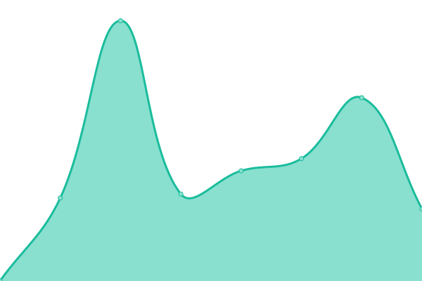

# [📈 Live Status](https://entropyhub.github.io/upptime): <!--live status--> **🟩 All systems operational**

This repository contains the open-source uptime monitor and status page for [Entropy](entropy.works), powered by [Upptime](https://github.com/upptime/upptime).

With [Upptime](https://upptime.js.org), you can get your own unlimited and free uptime monitor and status page, powered entirely by a GitHub repository. We use [Issues](https://github.com/entropyhub/upptime/issues) as incident reports, [Actions](https://github.com/entropyhub/upptime/actions) as uptime monitors, and [Pages](https://entropyhub.github.io/upptime) for the status page.

<!--start: status pages-->
<!-- This summary is generated by Upptime (https://github.com/upptime/upptime) -->
<!-- Do not edit this manually, your changes will be overwritten -->
<!-- prettier-ignore -->
| URL | Status | History | Response Time | Uptime |
| --- | ------ | ------- | ------------- | ------ |
|  [Lexico.com](https://www.lexico.com) | 🟩 Up | [lexico-com.yml](https://github.com/entropyhub/upptime/commits/master/history/lexico-com.yml) | 

 778ms
     
 | 

<a href="https://entropyhub.github.io/upptime/history/lexico-com">100.00%</a>
    

|  [Lexico Landing Page](https://www.lexico.com/about) | 🟩 Up | [lexico-landing-page.yml](https://github.com/entropyhub/upptime/commits/master/history/lexico-landing-page.yml) | 

 596ms
     
 | 

<a href="https://entropyhub.github.io/upptime/history/lexico-landing-page">100.00%</a>
    

|  [Lexico Category Page](https://www.lexico.com/grammar) | 🟩 Up | [lexico-category-page.yml](https://github.com/entropyhub/upptime/commits/master/history/lexico-category-page.yml) | 

 539ms
     
 | 

<a href="https://entropyhub.github.io/upptime/history/lexico-category-page">100.00%</a>
    

|  [Lexico Sitemap](https://www.lexico.com/sitemap) | 🟩 Up | [lexico-sitemap.yml](https://github.com/entropyhub/upptime/commits/master/history/lexico-sitemap.yml) | 

 267ms
     
 | 

<a href="https://entropyhub.github.io/upptime/history/lexico-sitemap">100.00%</a>
    

|  [Lexico English Definition](https://www.lexico.com/definition/bank) | 🟩 Up | [lexico-english-definition.yml](https://github.com/entropyhub/upptime/commits/master/history/lexico-english-definition.yml) | 

 940ms
     
 | 

<a href="https://entropyhub.github.io/upptime/history/lexico-english-definition">100.00%</a>
    

|  [Lexico Spanish Definition](https://www.lexico.com/es/definicion/agua) | 🟩 Up | [lexico-spanish-definition.yml](https://github.com/entropyhub/upptime/commits/master/history/lexico-spanish-definition.yml) | 

 466ms
     
 | 

<a href="https://entropyhub.github.io/upptime/history/lexico-spanish-definition">100.00%</a>
    

|  [Staging Lexico.com](https://staging.lexico.com) | 🟩 Up | [staging-lexico-com.yml](https://github.com/entropyhub/upptime/commits/master/history/staging-lexico-com.yml) | 

 1593ms
     
 | 

<a href="https://entropyhub.github.io/upptime/history/staging-lexico-com">100.00%</a>
    

|  [Staging Lexico.com Spanish Definition](https://staging.lexico.com/es/definicion/agua) | 🟩 Up | [staging-lexico-com-spanish-definition.yml](https://github.com/entropyhub/upptime/commits/master/history/staging-lexico-com-spanish-definition.yml) | 

 1403ms
     
 | 

<a href="https://entropyhub.github.io/upptime/history/staging-lexico-com-spanish-definition">100.00%</a>
    

|  [Staging Lexico.com/es/definicion Broken Page](https://staging.lexico.com/es/definicion) | 🟩 Up | [staging-lexico-com-es-definicion-broken-page.yml](https://github.com/entropyhub/upptime/commits/master/history/staging-lexico-com-es-definicion-broken-page.yml) | 

 486ms
     
 | 

<a href="https://entropyhub.github.io/upptime/history/staging-lexico-com-es-definicion-broken-page">77.38%</a>
    

|  [Lexico GSC Coverage](https://www.lexico.com/en/definition/word%) | 🟩 Up | [lexico-gsc-coverage.yml](https://github.com/entropyhub/upptime/commits/master/history/lexico-gsc-coverage.yml) | 

 419ms
     
 | 

<a href="https://entropyhub.github.io/upptime/history/lexico-gsc-coverage">0.00%</a>
    

|  [Lexico GSC Coverage](https://www.lexico.com/definition/training <042D><0442><043E>) | 🟩 Up | [lexico-gsc-coverage.yml](https://github.com/entropyhub/upptime/commits/master/history/lexico-gsc-coverage.yml) | 

 419ms
     
 | 

<a href="https://entropyhub.github.io/upptime/history/lexico-gsc-coverage">0.00%</a>
    

|  [Lexico GSC Coverage](https://www.lexico.com/definition/추락시키다) | 🟩 Up | [lexico-gsc-coverage.yml](https://github.com/entropyhub/upptime/commits/master/history/lexico-gsc-coverage.yml) | 

 419ms
     
 | 

<a href="https://entropyhub.github.io/upptime/history/lexico-gsc-coverage">0.00%</a>
    

|  [Lexico GSC Coverage](https://www.lexico.com/definition/word%) | 🟩 Up | [lexico-gsc-coverage.yml](https://github.com/entropyhub/upptime/commits/master/history/lexico-gsc-coverage.yml) | 

 419ms
     
 | 

<a href="https://entropyhub.github.io/upptime/history/lexico-gsc-coverage">0.00%</a>
    

|  [Lexico GSC Coverage](https://www.lexico.com/definition/post-truthhttps:/en.oxforddictionaries.com/definition/post-truth</a>

[2]</a>) | 🟩 Up | [lexico-gsc-coverage.yml](https://github.com/entropyhub/upptime/commits/master/history/lexico-gsc-coverage.yml) | 

 419ms
     
 | 

<a href="https://entropyhub.github.io/upptime/history/lexico-gsc-coverage">0.00%</a>
    

|  [Lexico GSC Coverage](https://www.lexico.com/definition/whirled) | 🟩 Up | [lexico-gsc-coverage.yml](https://github.com/entropyhub/upptime/commits/master/history/lexico-gsc-coverage.yml) | 

 419ms
     
 | 

<a href="https://entropyhub.github.io/upptime/history/lexico-gsc-coverage">0.00%</a>
    

|  [Lexico GSC Coverage](https://www.lexico.com/definition/cowchip) | 🟩 Up | [lexico-gsc-coverage.yml](https://github.com/entropyhub/upptime/commits/master/history/lexico-gsc-coverage.yml) | 

 419ms
     
 | 

<a href="https://entropyhub.github.io/upptime/history/lexico-gsc-coverage">0.00%</a>
    

|  [Lexico GSC Coverage](https://www.lexico.com/definition/millihertz) | 🟩 Up | [lexico-gsc-coverage.yml](https://github.com/entropyhub/upptime/commits/master/history/lexico-gsc-coverage.yml) | 

 419ms
     
 | 

<a href="https://entropyhub.github.io/upptime/history/lexico-gsc-coverage">0.00%</a>
    

|  [Lexico GSC Coverage](https://www.lexico.com/definition/rubberneck wagon) | 🟩 Up | [lexico-gsc-coverage.yml](https://github.com/entropyhub/upptime/commits/master/history/lexico-gsc-coverage.yml) | 

 419ms
     
 | 

<a href="https://entropyhub.github.io/upptime/history/lexico-gsc-coverage">0.00%</a>
    

|  [Lexico GSC Coverage](https://www.lexico.com/definition/바다가재) | 🟩 Up | [lexico-gsc-coverage.yml](https://github.com/entropyhub/upptime/commits/master/history/lexico-gsc-coverage.yml) | 

 419ms
     
 | 

<a href="https://entropyhub.github.io/upptime/history/lexico-gsc-coverage">0.00%</a>
    

|  [Lexico GSC Coverage](https://www.lexico.com/definition/맞지 않는) | 🟩 Up | [lexico-gsc-coverage.yml](https://github.com/entropyhub/upptime/commits/master/history/lexico-gsc-coverage.yml) | 

 419ms
     
 | 

<a href="https://entropyhub.github.io/upptime/history/lexico-gsc-coverage">0.00%</a>
    

|  [Lexico GSC Coverage](https://www.lexico.com/definition/dodad) | 🟩 Up | [lexico-gsc-coverage.yml](https://github.com/entropyhub/upptime/commits/master/history/lexico-gsc-coverage.yml) | 

 419ms
     
 | 

<a href="https://entropyhub.github.io/upptime/history/lexico-gsc-coverage">0.00%</a>
    

|  [Lexico GSC Coverage](https://www.lexico.com/synonyms/face_airing) | 🟩 Up | [lexico-gsc-coverage.yml](https://github.com/entropyhub/upptime/commits/master/history/lexico-gsc-coverage.yml) | 

 419ms
     
 | 

<a href="https://entropyhub.github.io/upptime/history/lexico-gsc-coverage">0.00%</a>
    

|  [Lexico GSC Coverage](https://www.lexico.com/synonyms/monochorionic) | 🟩 Up | [lexico-gsc-coverage.yml](https://github.com/entropyhub/upptime/commits/master/history/lexico-gsc-coverage.yml) | 

 419ms
     
 | 

<a href="https://entropyhub.github.io/upptime/history/lexico-gsc-coverage">0.00%</a>
    

|  [Lexico GSC Coverage](https://www.lexico.com/definition/CIWS) | 🟩 Up | [lexico-gsc-coverage.yml](https://github.com/entropyhub/upptime/commits/master/history/lexico-gsc-coverage.yml) | 

 419ms
     
 | 

<a href="https://entropyhub.github.io/upptime/history/lexico-gsc-coverage">0.00%</a>
    

|  [Lexico GSC Coverage](https://www.lexico.com/definition/긔틀) | 🟩 Up | [lexico-gsc-coverage.yml](https://github.com/entropyhub/upptime/commits/master/history/lexico-gsc-coverage.yml) | 

 419ms
     
 | 

<a href="https://entropyhub.github.io/upptime/history/lexico-gsc-coverage">0.00%</a>
    

|  [Lexico GSC Coverage](https://www.lexico.com/definition/대아) | 🟩 Up | [lexico-gsc-coverage.yml](https://github.com/entropyhub/upptime/commits/master/history/lexico-gsc-coverage.yml) | 

 419ms
     
 | 

<a href="https://entropyhub.github.io/upptime/history/lexico-gsc-coverage">0.00%</a>
    

|  [Lexico GSC Coverage](https://www.lexico.com/definition/송진) | 🟩 Up | [lexico-gsc-coverage.yml](https://github.com/entropyhub/upptime/commits/master/history/lexico-gsc-coverage.yml) | 

 419ms
     
 | 

<a href="https://entropyhub.github.io/upptime/history/lexico-gsc-coverage">0.00%</a>
    

|  [Lexico GSC Coverage](https://www.lexico.com/en/definition/Ouachita_River) | 🟩 Up | [lexico-gsc-coverage.yml](https://github.com/entropyhub/upptime/commits/master/history/lexico-gsc-coverage.yml) | 

 419ms
     
 | 

<a href="https://entropyhub.github.io/upptime/history/lexico-gsc-coverage">0.00%</a>
    

|  [Lexico GSC Coverage](https://www.lexico.com/definition/gerunds) | 🟩 Up | [lexico-gsc-coverage.yml](https://github.com/entropyhub/upptime/commits/master/history/lexico-gsc-coverage.yml) | 

 419ms
     
 | 

<a href="https://entropyhub.github.io/upptime/history/lexico-gsc-coverage">0.00%</a>
    

|  [Lexico GSC Coverage](https://www.lexico.com/definition/구슬옥) | 🟩 Up | [lexico-gsc-coverage.yml](https://github.com/entropyhub/upptime/commits/master/history/lexico-gsc-coverage.yml) | 

 419ms
     
 | 

<a href="https://entropyhub.github.io/upptime/history/lexico-gsc-coverage">0.00%</a>
    

|  [Lexico GSC Coverage](https://www.lexico.com/definition/固定作用) | 🟩 Up | [lexico-gsc-coverage.yml](https://github.com/entropyhub/upptime/commits/master/history/lexico-gsc-coverage.yml) | 

 419ms
     
 | 

<a href="https://entropyhub.github.io/upptime/history/lexico-gsc-coverage">0.00%</a>
    

|  [Lexico GSC Coverage](https://www.lexico.com/definition/skewers) | 🟩 Up | [lexico-gsc-coverage.yml](https://github.com/entropyhub/upptime/commits/master/history/lexico-gsc-coverage.yml) | 

 419ms
     
 | 

<a href="https://entropyhub.github.io/upptime/history/lexico-gsc-coverage">0.00%</a>
    

|  [Lexico GSC Coverage](https://www.lexico.com/definition/stay of execution) | 🟩 Up | [lexico-gsc-coverage.yml](https://github.com/entropyhub/upptime/commits/master/history/lexico-gsc-coverage.yml) | 

 419ms
     
 | 

<a href="https://entropyhub.github.io/upptime/history/lexico-gsc-coverage">0.00%</a>
    

|  [Lexico GSC Coverage](https://www.lexico.com/definition/미자) | 🟩 Up | [lexico-gsc-coverage.yml](https://github.com/entropyhub/upptime/commits/master/history/lexico-gsc-coverage.yml) | 

 419ms
     
 | 

<a href="https://entropyhub.github.io/upptime/history/lexico-gsc-coverage">0.00%</a>
    

|  [Lexico GSC Coverage](https://www.lexico.com/definition/존립) | 🟩 Up | [lexico-gsc-coverage.yml](https://github.com/entropyhub/upptime/commits/master/history/lexico-gsc-coverage.yml) | 

 419ms
     
 | 

<a href="https://entropyhub.github.io/upptime/history/lexico-gsc-coverage">0.00%</a>
    

|  [Lexico GSC Coverage](https://www.lexico.com/definition/쉐도우) | 🟩 Up | [lexico-gsc-coverage.yml](https://github.com/entropyhub/upptime/commits/master/history/lexico-gsc-coverage.yml) | 

 419ms
     
 | 

<a href="https://entropyhub.github.io/upptime/history/lexico-gsc-coverage">0.00%</a>
    

|  [Lexico GSC Coverage](https://www.lexico.com/definition/명명법) | 🟩 Up | [lexico-gsc-coverage.yml](https://github.com/entropyhub/upptime/commits/master/history/lexico-gsc-coverage.yml) | 

 419ms
     
 | 

<a href="https://entropyhub.github.io/upptime/history/lexico-gsc-coverage">0.00%</a>
    

|  [Lexico GSC Coverage](https://www.lexico.com/definition/주담) | 🟩 Up | [lexico-gsc-coverage.yml](https://github.com/entropyhub/upptime/commits/master/history/lexico-gsc-coverage.yml) | 

 419ms
     
 | 

<a href="https://entropyhub.github.io/upptime/history/lexico-gsc-coverage">0.00%</a>
    

|  [Lexico GSC Coverage](https://www.lexico.com/synonyms/pyridine_base) | 🟩 Up | [lexico-gsc-coverage.yml](https://github.com/entropyhub/upptime/commits/master/history/lexico-gsc-coverage.yml) | 

 419ms
     
 | 

<a href="https://entropyhub.github.io/upptime/history/lexico-gsc-coverage">0.00%</a>
    

|  [Lexico GSC Coverage](https://www.lexico.com/definition/수시 납치) | 🟩 Up | [lexico-gsc-coverage.yml](https://github.com/entropyhub/upptime/commits/master/history/lexico-gsc-coverage.yml) | 

 419ms
     
 | 

<a href="https://entropyhub.github.io/upptime/history/lexico-gsc-coverage">0.00%</a>
    

|  [Lexico GSC Coverage](https://www.lexico.com/definition/西风带) | 🟩 Up | [lexico-gsc-coverage.yml](https://github.com/entropyhub/upptime/commits/master/history/lexico-gsc-coverage.yml) | 

 419ms
     
 | 

<a href="https://entropyhub.github.io/upptime/history/lexico-gsc-coverage">0.00%</a>
    

|  [Lexico GSC Coverage](https://www.lexico.com/definition/spoiliation) | 🟩 Up | [lexico-gsc-coverage.yml](https://github.com/entropyhub/upptime/commits/master/history/lexico-gsc-coverage.yml) | 

 419ms
     
 | 

<a href="https://entropyhub.github.io/upptime/history/lexico-gsc-coverage">0.00%</a>
    

|  [Lexico GSC Coverage](https://www.lexico.com/definition/小事件) | 🟩 Up | [lexico-gsc-coverage.yml](https://github.com/entropyhub/upptime/commits/master/history/lexico-gsc-coverage.yml) | 

 419ms
     
 | 

<a href="https://entropyhub.github.io/upptime/history/lexico-gsc-coverage">0.00%</a>
    

|  [Lexico GSC Coverage](https://www.lexico.com/search?utf8) | 🟩 Up | [lexico-gsc-coverage.yml](https://github.com/entropyhub/upptime/commits/master/history/lexico-gsc-coverage.yml) | 

 419ms
     
 | 

<a href="https://entropyhub.github.io/upptime/history/lexico-gsc-coverage">0.00%</a>
    

|  [Lexico GSC Coverage](https://www.lexico.com/en/explore/us_sample_academic_CV.pdf) | 🟩 Up | [lexico-gsc-coverage.yml](https://github.com/entropyhub/upptime/commits/master/history/lexico-gsc-coverage.yml) | 

 419ms
     
 | 

<a href="https://entropyhub.github.io/upptime/history/lexico-gsc-coverage">0.00%</a>
    

|  [Lexico GSC Coverage](https://www.lexico.com/en/explore/us_sample_career_transition_resume.pdf) | 🟩 Up | [lexico-gsc-coverage.yml](https://github.com/entropyhub/upptime/commits/master/history/lexico-gsc-coverage.yml) | 

 419ms
     
 | 

<a href="https://entropyhub.github.io/upptime/history/lexico-gsc-coverage">0.00%</a>
    

|  [Lexico GSC Coverage](https://www.lexico.com/synonym/down_to_earth) | 🟩 Up | [lexico-gsc-coverage.yml](https://github.com/entropyhub/upptime/commits/master/history/lexico-gsc-coverage.yml) | 

 419ms
     
 | 

<a href="https://entropyhub.github.io/upptime/history/lexico-gsc-coverage">0.00%</a>
    

|  [Lexico GSC Coverage](https://www.lexico.com/en/explore/us_sample_entry-level_resume.pdf) | 🟩 Up | [lexico-gsc-coverage.yml](https://github.com/entropyhub/upptime/commits/master/history/lexico-gsc-coverage.yml) | 

 419ms
     
 | 

<a href="https://entropyhub.github.io/upptime/history/lexico-gsc-coverage">0.00%</a>
    

|  [Lexico GSC Coverage](https://www.lexico.com/synonyms/prepuberally) | 🟩 Up | [lexico-gsc-coverage.yml](https://github.com/entropyhub/upptime/commits/master/history/lexico-gsc-coverage.yml) | 

 419ms
     
 | 

<a href="https://entropyhub.github.io/upptime/history/lexico-gsc-coverage">0.00%</a>
    

|  [Lexico GSC Coverage](https://www.lexico.com/en/definition/phobia%) | 🟩 Up | [lexico-gsc-coverage.yml](https://github.com/entropyhub/upptime/commits/master/history/lexico-gsc-coverage.yml) | 

 419ms
     
 | 

<a href="https://entropyhub.github.io/upptime/history/lexico-gsc-coverage">0.00%</a>
    

|  [Lexico GSC Coverage](https://www.lexico.com/en/definition/%s) | 🟩 Up | [lexico-gsc-coverage.yml](https://github.com/entropyhub/upptime/commits/master/history/lexico-gsc-coverage.yml) | 

 419ms
     
 | 

<a href="https://entropyhub.github.io/upptime/history/lexico-gsc-coverage">0.00%</a>
    

|  [Lexico GSC Coverage](https://www.lexico.com/synonyms/narrow-heartedness) | 🟩 Up | [lexico-gsc-coverage.yml](https://github.com/entropyhub/upptime/commits/master/history/lexico-gsc-coverage.yml) | 

 419ms
     
 | 

<a href="https://entropyhub.github.io/upptime/history/lexico-gsc-coverage">0.00%</a>
    

|  [Lexico GSC Coverage](https://www.lexico.com/en/definition/specific rotation) | 🟩 Up | [lexico-gsc-coverage.yml](https://github.com/entropyhub/upptime/commits/master/history/lexico-gsc-coverage.yml) | 

 419ms
     
 | 

<a href="https://entropyhub.github.io/upptime/history/lexico-gsc-coverage">0.00%</a>
    

|  [Lexico GSC Coverage](https://www.lexico.com/definition/kennelly_layer?s=t) | 🟩 Up | [lexico-gsc-coverage.yml](https://github.com/entropyhub/upptime/commits/master/history/lexico-gsc-coverage.yml) | 

 419ms
     
 | 

<a href="https://entropyhub.github.io/upptime/history/lexico-gsc-coverage">0.00%</a>
    

|  [Lexico GSC Coverage](https://www.lexico.com/definition/foot_valve?s=t) | 🟩 Up | [lexico-gsc-coverage.yml](https://github.com/entropyhub/upptime/commits/master/history/lexico-gsc-coverage.yml) | 

 419ms
     
 | 

<a href="https://entropyhub.github.io/upptime/history/lexico-gsc-coverage">0.00%</a>
    

|  [Lexico GSC Coverage](https://www.lexico.com/en/definition/Ab integro) | 🟩 Up | [lexico-gsc-coverage.yml](https://github.com/entropyhub/upptime/commits/master/history/lexico-gsc-coverage.yml) | 

 419ms
     
 | 

<a href="https://entropyhub.github.io/upptime/history/lexico-gsc-coverage">0.00%</a>
    

|  [Lexico GSC Coverage](https://www.lexico.com/synonyms/protestatory) | 🟩 Up | [lexico-gsc-coverage.yml](https://github.com/entropyhub/upptime/commits/master/history/lexico-gsc-coverage.yml) | 

 419ms
     
 | 

<a href="https://entropyhub.github.io/upptime/history/lexico-gsc-coverage">0.00%</a>
    

|  [Lexico GSC Coverage](https://www.lexico.com/synonyms/mummy-like) | 🟩 Up | [lexico-gsc-coverage.yml](https://github.com/entropyhub/upptime/commits/master/history/lexico-gsc-coverage.yml) | 

 419ms
     
 | 

<a href="https://entropyhub.github.io/upptime/history/lexico-gsc-coverage">0.00%</a>
    

|  [Lexico GSC Coverage](https://www.lexico.com/synonyms/microlight) | 🟩 Up | [lexico-gsc-coverage.yml](https://github.com/entropyhub/upptime/commits/master/history/lexico-gsc-coverage.yml) | 

 419ms
     
 | 

<a href="https://entropyhub.github.io/upptime/history/lexico-gsc-coverage">0.00%</a>
    

|  [Lexico GSC Coverage](https://www.lexico.com/synonyms/aksumite) | 🟩 Up | [lexico-gsc-coverage.yml](https://github.com/entropyhub/upptime/commits/master/history/lexico-gsc-coverage.yml) | 

 419ms
     
 | 

<a href="https://entropyhub.github.io/upptime/history/lexico-gsc-coverage">0.00%</a>
    

|  [Lexico GSC Coverage](https://www.lexico.com/synonyms/oarage) | 🟩 Up | [lexico-gsc-coverage.yml](https://github.com/entropyhub/upptime/commits/master/history/lexico-gsc-coverage.yml) | 

 419ms
     
 | 

<a href="https://entropyhub.github.io/upptime/history/lexico-gsc-coverage">0.00%</a>
    

|  [Lexico GSC Coverage](https://www.lexico.com/synonyms/ins) | 🟩 Up | [lexico-gsc-coverage.yml](https://github.com/entropyhub/upptime/commits/master/history/lexico-gsc-coverage.yml) | 

 419ms
     
 | 

<a href="https://entropyhub.github.io/upptime/history/lexico-gsc-coverage">0.00%</a>
    

|  [Lexico GSC Coverage](https://www.lexico.com/definition/as+thick+as+two%2) | 🟩 Up | [lexico-gsc-coverage.yml](https://github.com/entropyhub/upptime/commits/master/history/lexico-gsc-coverage.yml) | 

 419ms
     
 | 

<a href="https://entropyhub.github.io/upptime/history/lexico-gsc-coverage">0.00%</a>
    

|  [Lexico GSC Coverage](https://www.lexico.com/definition/caf%c) | 🟩 Up | [lexico-gsc-coverage.yml](https://github.com/entropyhub/upptime/commits/master/history/lexico-gsc-coverage.yml) | 

 419ms
     
 | 

<a href="https://entropyhub.github.io/upptime/history/lexico-gsc-coverage">0.00%</a>
    

|  [Lexico GSC Coverage](https://www.lexico.com/definition/webtoonhttp:/gadgetplus.id/line-webtoon-x-popcon-asia/2016.http:/science.nas.nasa.gov/Pubs/TechReports/NASreports/NAS-98-014http:/www.antaranews.com/berita/495706/line-hadirkan-webtoon-platform-http:/www.antaranews.com/berita/495706/line-hadirkan-webtoon-platform-http:/www.antaranews.com/berita/495706/line-hadirkan-webtoon-platform-digital-bagi-pecinta-komikhttp:/www.kompasiana.com/rikkai/webtoon-dan-kualitaskomentar-remaja-) | 🟩 Up | [lexico-gsc-coverage.yml](https://github.com/entropyhub/upptime/commits/master/history/lexico-gsc-coverage.yml) | 

 419ms
     
 | 

<a href="https://entropyhub.github.io/upptime/history/lexico-gsc-coverage">0.00%</a>
    

|  [Lexico GSC Coverage](https://www.lexico.com/definition/art [06) | 🟩 Up | [lexico-gsc-coverage.yml](https://github.com/entropyhub/upptime/commits/master/history/lexico-gsc-coverage.yml) | 

 419ms
     
 | 

<a href="https://entropyhub.github.io/upptime/history/lexico-gsc-coverage">0.00%</a>
    

|  [Lexico GSC Coverage](https://www.lexico.com/definition/city [06) | 🟩 Up | [lexico-gsc-coverage.yml](https://github.com/entropyhub/upptime/commits/master/history/lexico-gsc-coverage.yml) | 

 419ms
     
 | 

<a href="https://entropyhub.github.io/upptime/history/lexico-gsc-coverage">0.00%</a>
    

|  [Lexico GSC Coverage](https://www.lexico.com/en/definition/public assistance) | 🟩 Up | [lexico-gsc-coverage.yml](https://github.com/entropyhub/upptime/commits/master/history/lexico-gsc-coverage.yml) | 

 419ms
     
 | 

<a href="https://entropyhub.github.io/upptime/history/lexico-gsc-coverage">0.00%</a>
    

|  [Lexico GSC Coverage](https://www.lexico.com/definition/potential [accessed 17/10/2016) | 🟩 Up | [lexico-gsc-coverage.yml](https://github.com/entropyhub/upptime/commits/master/history/lexico-gsc-coverage.yml) | 

 419ms
     
 | 

<a href="https://entropyhub.github.io/upptime/history/lexico-gsc-coverage">0.00%</a>
    

|  [Lexico GSC Coverage](https://www.lexico.com/definition/重庆yabo亚搏预测号码【┃总代2⒏7⒏01705[ｑ]】】) | 🟩 Up | [lexico-gsc-coverage.yml](https://github.com/entropyhub/upptime/commits/master/history/lexico-gsc-coverage.yml) | 

 419ms
     
 | 

<a href="https://entropyhub.github.io/upptime/history/lexico-gsc-coverage">0.00%</a>
    

|  [Lexico GSC Coverage](https://www.lexico.com/definition/substitute [150328) | 🟩 Up | [lexico-gsc-coverage.yml](https://github.com/entropyhub/upptime/commits/master/history/lexico-gsc-coverage.yml) | 

 419ms
     
 | 

<a href="https://entropyhub.github.io/upptime/history/lexico-gsc-coverage">0.00%</a>
    

|  [Lexico GSC Coverage](https://www.lexico.com/definition/curlicues) | 🟩 Up | [lexico-gsc-coverage.yml](https://github.com/entropyhub/upptime/commits/master/history/lexico-gsc-coverage.yml) | 

 419ms
     
 | 

<a href="https://entropyhub.github.io/upptime/history/lexico-gsc-coverage">0.00%</a>
    

|  [Lexico GSC Coverage](https://www.lexico.com/definition/scanner driver) | 🟩 Up | [lexico-gsc-coverage.yml](https://github.com/entropyhub/upptime/commits/master/history/lexico-gsc-coverage.yml) | 

 419ms
     
 | 

<a href="https://entropyhub.github.io/upptime/history/lexico-gsc-coverage">0.00%</a>
    

|  [Lexico GSC Coverage](https://www.lexico.com/definition/grigri) | 🟩 Up | [lexico-gsc-coverage.yml](https://github.com/entropyhub/upptime/commits/master/history/lexico-gsc-coverage.yml) | 

 419ms
     
 | 

<a href="https://entropyhub.github.io/upptime/history/lexico-gsc-coverage">0.00%</a>
    

|  [Lexico GSC Coverage](https://www.lexico.com/search?filter=en_dictionary&query=what_do_you_know_about_that) | 🟩 Up | [lexico-gsc-coverage.yml](https://github.com/entropyhub/upptime/commits/master/history/lexico-gsc-coverage.yml) | 

 419ms
     
 | 

<a href="https://entropyhub.github.io/upptime/history/lexico-gsc-coverage">0.00%</a>
    

|  [Lexico GSC Coverage](https://www.lexico.com/definition/frame-driven) | 🟩 Up | [lexico-gsc-coverage.yml](https://github.com/entropyhub/upptime/commits/master/history/lexico-gsc-coverage.yml) | 

 419ms
     
 | 

<a href="https://entropyhub.github.io/upptime/history/lexico-gsc-coverage">0.00%</a>
    

|  [Lexico GSC Coverage](https://www.lexico.com/definition/curity) | 🟩 Up | [lexico-gsc-coverage.yml](https://github.com/entropyhub/upptime/commits/master/history/lexico-gsc-coverage.yml) | 

 419ms
     
 | 

<a href="https://entropyhub.github.io/upptime/history/lexico-gsc-coverage">0.00%</a>
    

|  [Lexico GSC Coverage](https://www.lexico.com/definition/pendentives) | 🟩 Up | [lexico-gsc-coverage.yml](https://github.com/entropyhub/upptime/commits/master/history/lexico-gsc-coverage.yml) | 

 419ms
     
 | 

<a href="https://entropyhub.github.io/upptime/history/lexico-gsc-coverage">0.00%</a>
    

|  [Lexico GSC Coverage](https://www.lexico.com/definition/chopper spectrometer) | 🟩 Up | [lexico-gsc-coverage.yml](https://github.com/entropyhub/upptime/commits/master/history/lexico-gsc-coverage.yml) | 

 419ms
     
 | 

<a href="https://entropyhub.github.io/upptime/history/lexico-gsc-coverage">0.00%</a>
    

|  [Lexico GSC Coverage](https://www.lexico.com/definition/枹木履) | 🟩 Up | [lexico-gsc-coverage.yml](https://github.com/entropyhub/upptime/commits/master/history/lexico-gsc-coverage.yml) | 

 419ms
     
 | 

<a href="https://entropyhub.github.io/upptime/history/lexico-gsc-coverage">0.00%</a>
    

|  [Lexico GSC Coverage](https://www.lexico.com/definition/awar[broken reference: aware__2]) | 🟩 Up | [lexico-gsc-coverage.yml](https://github.com/entropyhub/upptime/commits/master/history/lexico-gsc-coverage.yml) | 

 419ms
     
 | 

<a href="https://entropyhub.github.io/upptime/history/lexico-gsc-coverage">0.00%</a>
    

|  [Lexico GSC Coverage](https://www.lexico.com/en/definition/peracarid_[adjective]) | 🟩 Up | [lexico-gsc-coverage.yml](https://github.com/entropyhub/upptime/commits/master/history/lexico-gsc-coverage.yml) | 

 419ms
     
 | 

<a href="https://entropyhub.github.io/upptime/history/lexico-gsc-coverage">0.00%</a>
    

|  [Lexico GSC Coverage](https://www.lexico.com/en/definition/subsidiarity]) | 🟩 Up | [lexico-gsc-coverage.yml](https://github.com/entropyhub/upptime/commits/master/history/lexico-gsc-coverage.yml) | 

 419ms
     
 | 

<a href="https://entropyhub.github.io/upptime/history/lexico-gsc-coverage">0.00%</a>
    

<!--end: status pages-->

[**Visit our status website →**](https://entropyhub.github.io/upptime)

## 📄 License

- Powered by: [Upptime](https://github.com/upptime/upptime)
- Code: [MIT](./LICENSE) © [Entropy](entropy.works)
- Data in the `./history` directory: [Open Database License](https://opendatacommons.org/licenses/odbl/1-0/)
