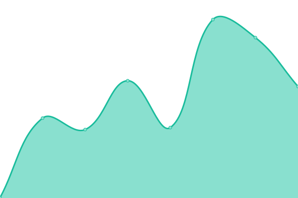

# [📈 Live Status](https://entropyhub.github.io/upptime): <!--live status--> **🟩 All systems operational**

This repository contains the open-source uptime monitor and status page for [Entropy](entropy.works), powered by [Upptime](https://github.com/upptime/upptime).

With [Upptime](https://upptime.js.org), you can get your own unlimited and free uptime monitor and status page, powered entirely by a GitHub repository. We use [Issues](https://github.com/entropyhub/upptime/issues) as incident reports, [Actions](https://github.com/entropyhub/upptime/actions) as uptime monitors, and [Pages](https://entropyhub.github.io/upptime) for the status page.

<!--start: status pages-->
<!-- This summary is generated by Upptime (https://github.com/upptime/upptime) -->
<!-- Do not edit this manually, your changes will be overwritten -->
<!-- prettier-ignore -->
| URL | Status | History | Response Time | Uptime |
| --- | ------ | ------- | ------------- | ------ |
|  [Lexico.com](https://www.lexico.com) | 🟩 Up | [lexico-com.yml](https://github.com/entropyhub/upptime/commits/HEAD/history/lexico-com.yml) | 

 736ms
     
 | 

<a href="https://entropyhub.github.io/upptime/history/lexico-com">100.00%</a>
    

|  [Lexico Landing Page](https://www.lexico.com/about) | 🟩 Up | [lexico-landing-page.yml](https://github.com/entropyhub/upptime/commits/HEAD/history/lexico-landing-page.yml) | 

 445ms
     
 | 

<a href="https://entropyhub.github.io/upptime/history/lexico-landing-page">100.00%</a>
    

|  [Lexico Category Page](https://www.lexico.com/grammar) | 🟩 Up | [lexico-category-page.yml](https://github.com/entropyhub/upptime/commits/HEAD/history/lexico-category-page.yml) | 

 453ms
     
 | 

<a href="https://entropyhub.github.io/upptime/history/lexico-category-page">100.00%</a>
    

|  [Lexico Sitemap](https://www.lexico.com/sitemap) | 🟩 Up | [lexico-sitemap.yml](https://github.com/entropyhub/upptime/commits/HEAD/history/lexico-sitemap.yml) | 

 150ms
     
 | 

<a href="https://entropyhub.github.io/upptime/history/lexico-sitemap">100.00%</a>
    

|  [Lexico English Definition](https://www.lexico.com/definition/bank) | 🟩 Up | [lexico-english-definition.yml](https://github.com/entropyhub/upptime/commits/HEAD/history/lexico-english-definition.yml) | 

 1003ms
     
 | 

<a href="https://entropyhub.github.io/upptime/history/lexico-english-definition">100.00%</a>
    

|  [Lexico Spanish Definition](https://www.lexico.com/es/definicion/agua) | 🟩 Up | [lexico-spanish-definition.yml](https://github.com/entropyhub/upptime/commits/HEAD/history/lexico-spanish-definition.yml) | 

 415ms
     
 | 

<a href="https://entropyhub.github.io/upptime/history/lexico-spanish-definition">100.00%</a>
    

|  [Staging Lexico.com](https://staging.lexico.com) | 🟩 Up | [staging-lexico-com.yml](https://github.com/entropyhub/upptime/commits/HEAD/history/staging-lexico-com.yml) | 

 1217ms
     
 | 

<a href="https://entropyhub.github.io/upptime/history/staging-lexico-com">100.00%</a>
    

|  [Staging Lexico.com Spanish Definition](https://staging.lexico.com/es/definicion/agua) | 🟩 Up | [staging-lexico-com-spanish-definition.yml](https://github.com/entropyhub/upptime/commits/HEAD/history/staging-lexico-com-spanish-definition.yml) | 

 910ms
     
 | 

<a href="https://entropyhub.github.io/upptime/history/staging-lexico-com-spanish-definition">65.30%</a>
    

|  [Staging Lexico.com/es/definicion Broken Page](https://staging.lexico.com/es/definicion) | 🟩 Up | [staging-lexico-com-es-definicion-broken-page.yml](https://github.com/entropyhub/upptime/commits/HEAD/history/staging-lexico-com-es-definicion-broken-page.yml) | 

 636ms
     
 | 

<a href="https://entropyhub.github.io/upptime/history/staging-lexico-com-es-definicion-broken-page">100.00%</a>
    

<!--end: status pages-->

[**Visit our status website →**](https://entropyhub.github.io/upptime)

## 📄 License

- Powered by: [Upptime](https://github.com/upptime/upptime)
- Code: [MIT](./LICENSE) © [Entropy](entropy.works)
- Data in the `./history` directory: [Open Database License](https://opendatacommons.org/licenses/odbl/1-0/)
